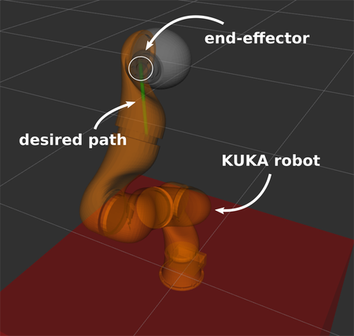

#### Assignment2

Download the file [Assignment_2_kinematics.zip](https://drive.google.com/file/d/1rWtw5aCTehons2TRChDsdTaCBcaOQ-0q/view?usp=sharing) and decompress it. Put the ROS package in your ROS workspace and run catkin_make. Remember to source the devel/setup.bash file if needed. The python file kinematics_assignment_metapackage/kinematics_assignment/scripts/IK_functions.py is the file you have to modify.

* Scalar Robotic:
A 3 DOF scara robot, with an inverse kinematic solution that is possible in analytic form.

[Scara Robot Video](https://youtu.be/rsxZDhXIY-Q)

To visualize Scara, run: 

        roslaunch kinematics_assignment scara_launch.launch

* Kuka Robotic:

[KUKA Robot Video](https://youtu.be/A-MGo2cvHNs)

Solving this part will guarantee the best grade 

To visualize Kuka, run: 

        roslaunch kinematics_assignment kuka_launch.launch

For a solution to compute the robot's Jacobian, you can check the section "Jacobian computation" at page 111 in Springer's [Robotics: Modelling, Planning and Control](https://link.springer.com/book/10.1007%2F978-1-84628-642-1). 
